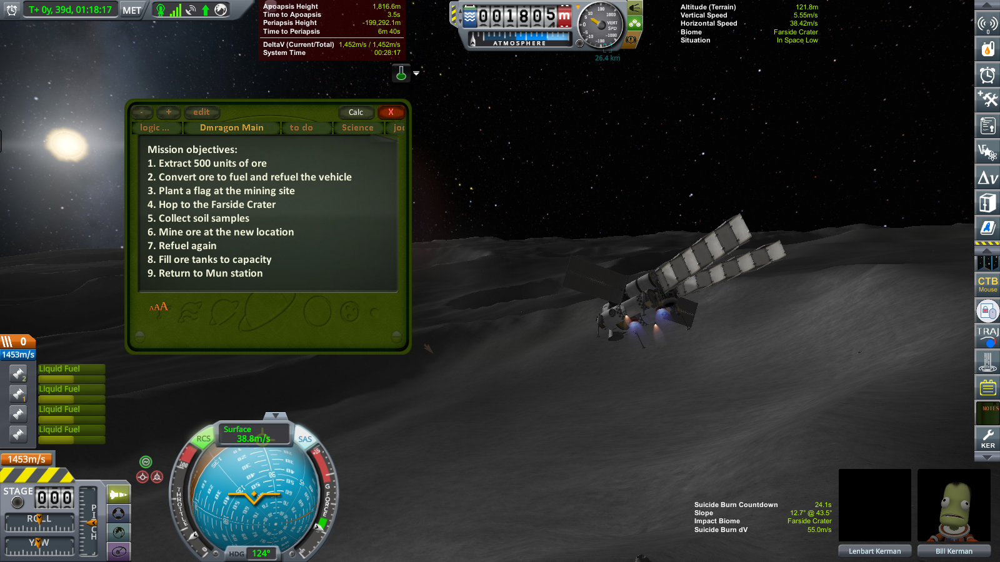
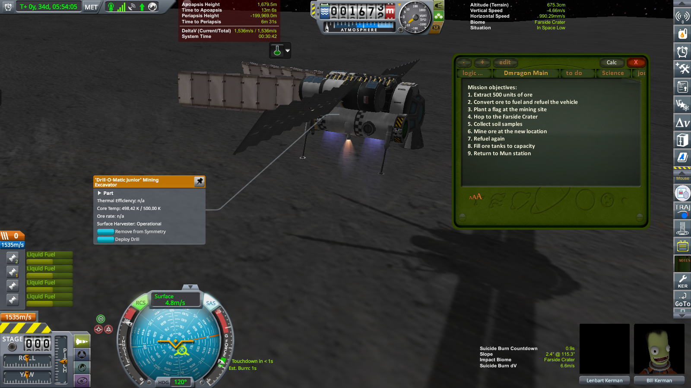
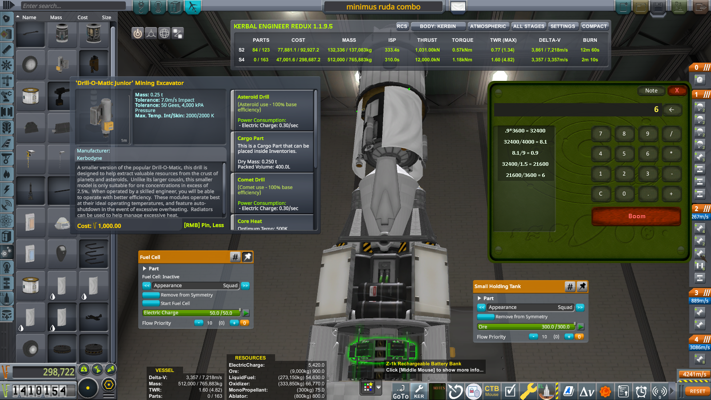

How to Download the Correct Version
To install this mod properly:
- Do not use the green “Code → Download ZIP” button — it downloads the entire source code, not the installable version.
- Instead, go to the Releases page https://github.com/garyblu71mods/KerbNoteLite/releases/tag/v1.1
- Download the file named KerbCalcProjekt.zip (or similar).
- Extract the ZIP and place the KerbCalcProjekt/ folder directly into your GameData/ directory.
 That’s it — you’re ready to launch!

# KerbNote Lite

> Modular notepad + calculator for KSP — minimal GUI, orbital clarity, zero distractions.

KerbNote Lite is designed for players who plan, log, and execute with precision.  
No automation. No dependencies. Just modular control — the Blu71 way.

---

###  GUI Previews

  

Mission info, resources, and control interface visible. Tabbed layout tested in field conditions.

  

Resource panel and mission details open. GUI remains stable under Mun conditions.

Calculations performed in the VAB to optimize lander desig.

  

Tabbed interface introduced in v1.1 — layout remains clean and focused.

  
Tabbed layout using the `green` skin — clean, high-contrast interface for science-focused missions.

---

###  Features

- Drop-in DLL for Unity/KSP environments  
- Minimalist GUI — no menus, no automation  
- Built-in calculator logic (manual input only)  
- Texture variants: `stock`, `vaos`, `green` — swap manually  
- No dependencies, no installer  
- Packaged with `README.md`, `LICENSE.txt`, and optional previews

---

###  Manual Texture Swapping

To change GUI style:

1. Go to `/Textures/`
2. Replace contents with files from:
   - `/texture_pack/vaos/`
   - `/texture_pack/green/`
   - `/texture_pack/stock/`
3. Restart game

Rollback anytime by restoring original folder.

---

### 🚀 What's new in v1.1:
- Tabbed note system (create, switch, rearrange)
- GUI layout improvements
- Calculator presets coming soon

Rollback-ready, no dependencies. Compatible with KSP 1.12.x

---

Made by Blu71 — for players who prefer control over clutter.

---

###  Support

If you enjoy KerbNote Lite and want to support future development:

- [PayPal.me/GaryBlu71](https://paypal.me/GaryBlu71) — one-time tip

Your support helps keep the mod modular, rollback-ready, and clean.
